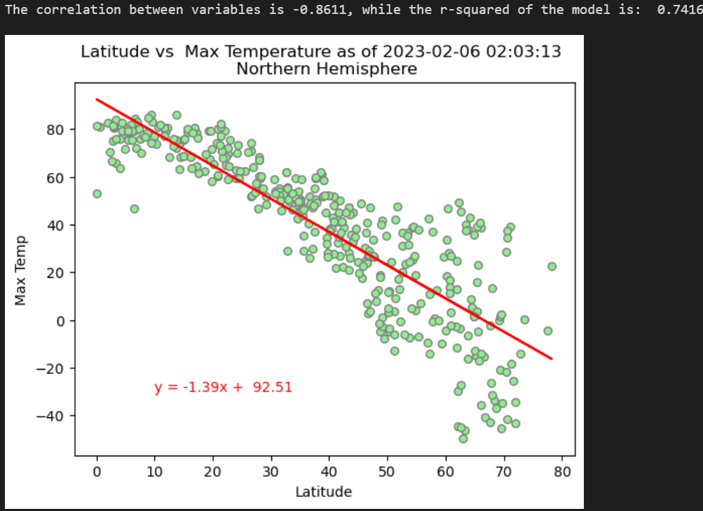
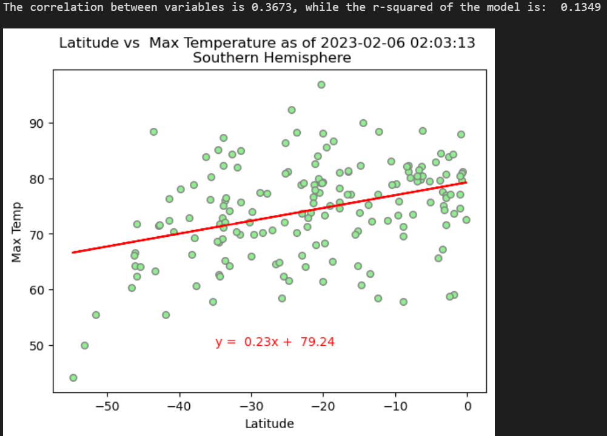
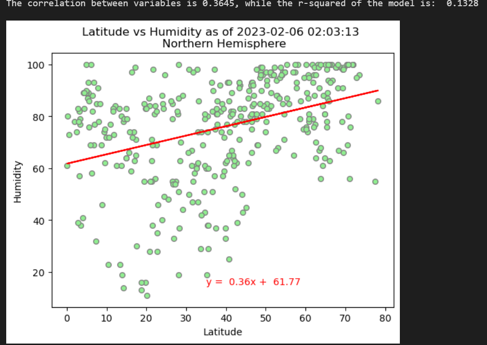
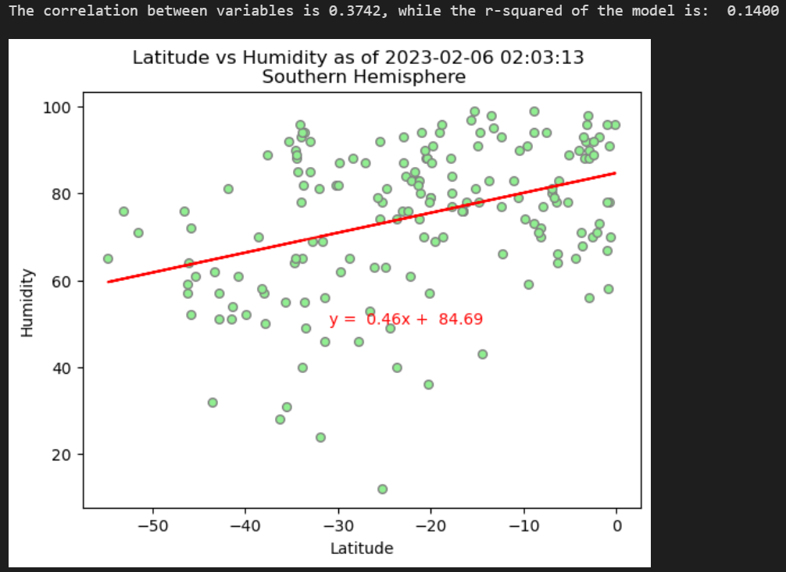
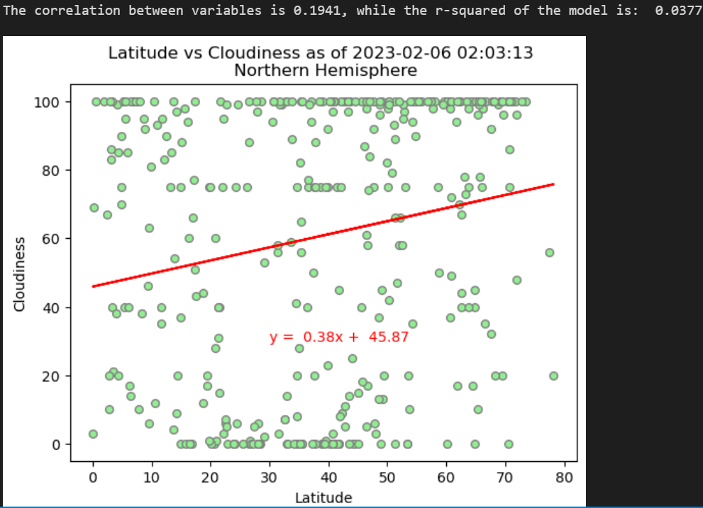
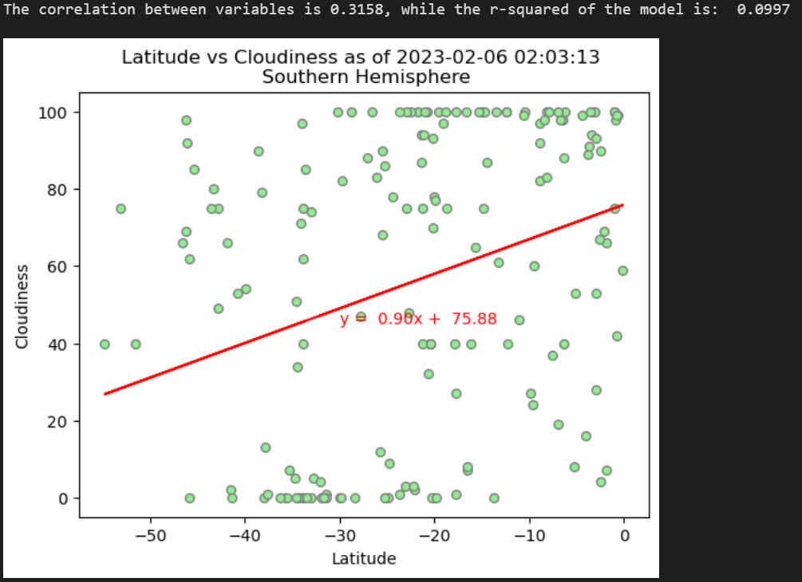
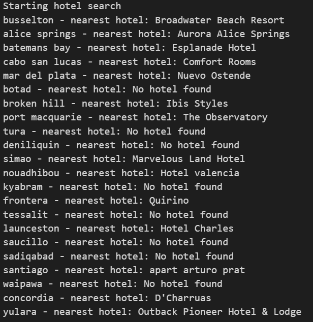
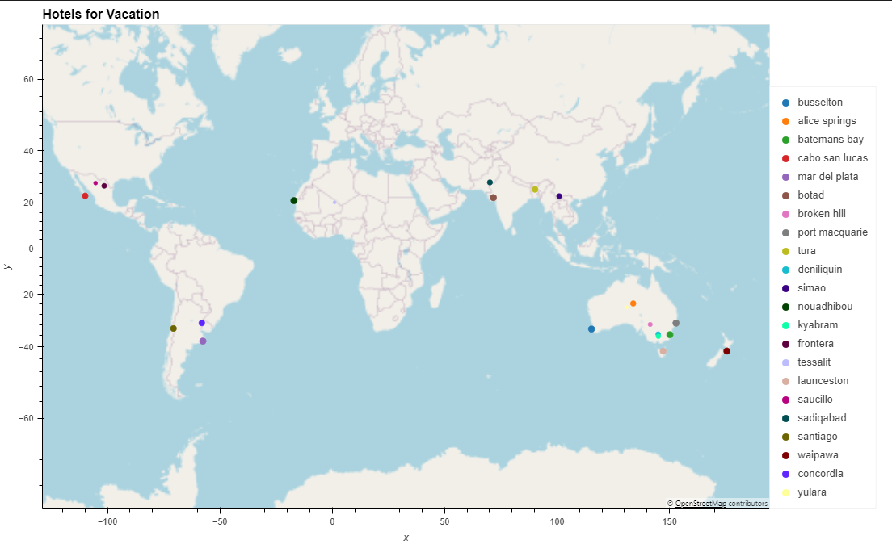
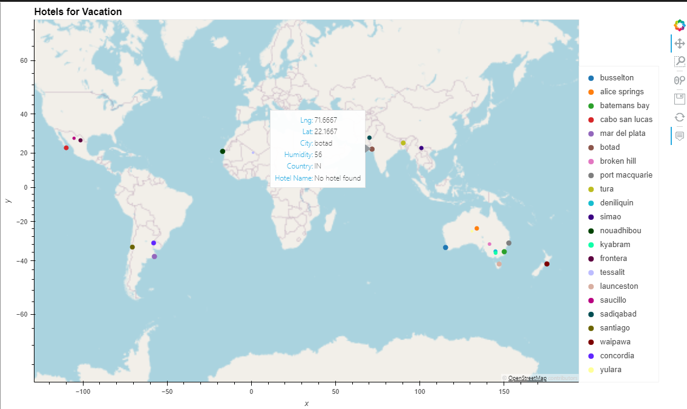

# Python-Api-Challenge

Structure of the repository:
This folder contains:
    - A ReadMe file with the description and results of the analysis
    - A folder called WeatherPy that contains
        -The WeatherPy file withe the code and results for the first part of the project.
        -The VacationPy file with the results and findings for the second part of the project.
        -The folder Output_data folder with 
            The sample of generated cities and their information.
            Graphs with the relations between Latitude of the sampled cities and their different variables.

WEATHER PY Results

The model selectd 600 random latitudes that correspondede to 540 valid cities analyzed. With these data we generated the table city_data_df and were saved on the file output_data/cities.csv

We were asked to plot the relations between Latitude and other weather factors as: max temperature, humidity, cloudiness and wind speed and show the linear relation between these variables. As an example we include here the graph comparing Latitude vs Temperrature for the entire sample.  

# Latitude vs
## Temperature
**Discussion** There are signs of strong negative correlation (-0.86) between latitude and temperature in the northern hemisphere. Thus it is to be expected the city's temperature will drop around 1.39 times the distance from the equator it is situated. This relationship is not that clear for the cities ubicated in the southern hemisphere, where a correlation of 0.37 signals weak linear relationship between the two variables. As a consequence we can conclude a linear model is a good fit (with an r-square of 0.74) for modeling temperature based on the location of the city in the north hemisphere but not that much (r-square of just 0.1349) for the cities below the equator.  

      

# Humidity
**Discussion** Latitude and Humidity show weak positive corelation between them. Both linear models show r squares of 0.14 or less, results that mean the models don't explain any relation between the variables. Moreover humidity seems to be high for many cities in this sample, regardless of their position towards the equator.

# Cloudiness
**Discussion** Same as with Humidity. Latitude and Cloudiness show weak relationship between them. Although the linear relation between these variables is a little bigger in the southern hemisphere, the results are not conclusive as the adjustment of the model is very weak (0.0997). 

#Wind speed
**Discussion** For the Northern Hemisphere the variables show no sign of relationshiop. With a correlation of   0.032 and a r-square for the model of 0.001 the model is definetley a bad fit. On the other hand speed of the wind and latitude have a moderate negative linear relation (-0.41) in the south part of the globe. However this linear model is not a good fit for prediction and the r-square of it is 0.17.

VACATION PY
For this part we create a map plotting all the random cities in the map. The points are proportional to the level of humidity in the city. 

 

From this set I chose a vacation place with the following characteristics: a maximum temperature between 60 an 95 Farenheit degrees, with humidity levels less than 60% and cloudiness near to zero (<5%).

Those conditions, joined to the fact that we had random latitude and longitude coordinates (generated by the program in Weatherpy) threw 22 cities with a real hotel within 10,000 meters from those coordinates. The results were plotted in the following image. 

